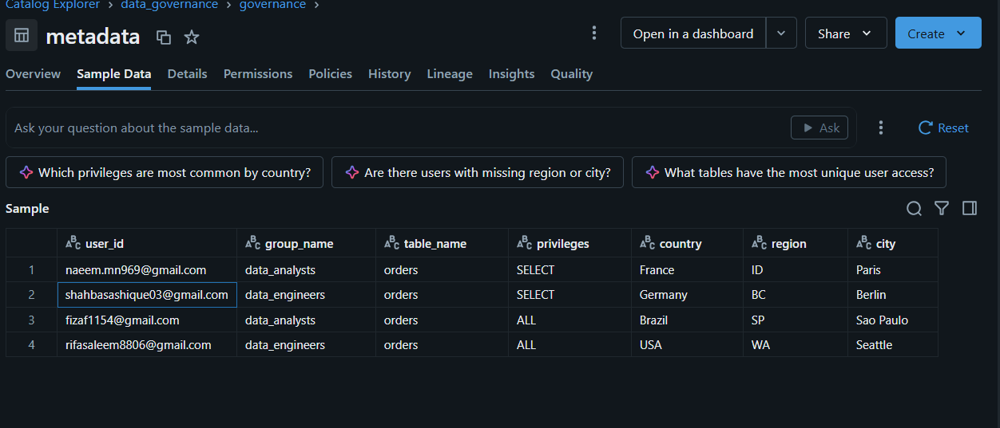
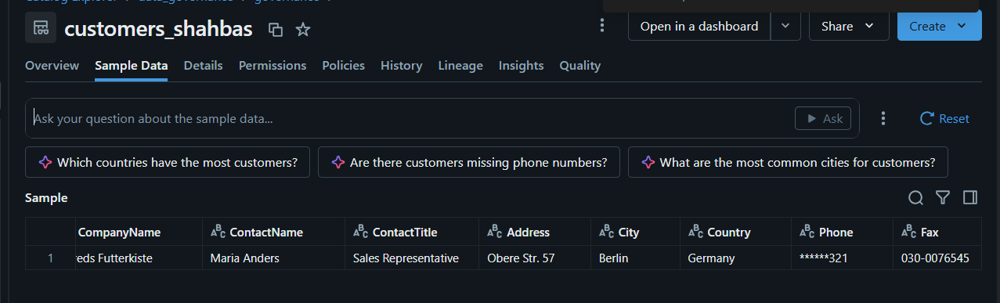

# Databricks Data Governance

## Overview

This project demonstrates the implementation of **Data Governance using Databricks and Unity Catalog**.

The main goal was to understand how data can be organized, accessed, restricted, and protected based on user requirements.

## Technologies Used

- Databricks
- Unity Catalog
- SQL
- Data Governance
- Access Control
- Data Masking
- Views

## Project Architecture

CSV Files  
↓  
Databricks Volume  
↓  
Unity Catalog  
↓  
Governed Tables  
↓  
Access Control  
↓  
Restricted Views  
↓  
Data Masking

## Data Assets

The project uses three datasets:

- Customers
- Orders
- Suppliers

The data is organized under:

`data_governance.governance`

## Governance Features Implemented

### 1. Unity Catalog

Created a catalog and schema to organize and manage governed data assets.

### 2. Data Ingestion

Uploaded CSV files to a Databricks Volume and created tables from the uploaded data.

### 3. Metadata Management

Created a metadata table to maintain information such as:

- User ID
- Group
- Table
- Privileges
- Country
- Region
- City

### 4. Access Control

Implemented controlled access using Databricks permissions and `GRANT` statements.

### 5. Restricted Views

Created views to provide users with access only to the required rows and columns.

For example, users can be restricted based on:

- Country
- Region
- City

### 6. Column Masking

Implemented phone number masking to protect sensitive information.

Example:

`030-0074321` → `******321`

### 7. Row-Level Data Restriction

Created user-specific views that return only the required records based on geographic conditions.

## Screenshots

### Unity Catalog Structure

### Access Governance Metadata

### Data Masking and Restricted Data

## Key Concepts Learned

- Data Governance
- Unity Catalog
- Catalog and Schema
- Metadata Management
- Access Control
- Least Privilege
- Restricted Views
- Row-Level Data Access
- Column Masking
- User-Defined Functions
- Data Security

## Project Outcome

This project helped me understand how data governance can be implemented in Databricks to provide **secure, controlled, and purpose-based access to data**.

## Future Improvements

- Role-based access control using groups
- Data classification and tagging
- Data lineage
- Audit and access history
- Data quality checks
- Automated governance workflows

## Disclaimer

This project was created for learning and demonstration purposes. The datasets used are sample data, and the original source files are not included in this repository.
